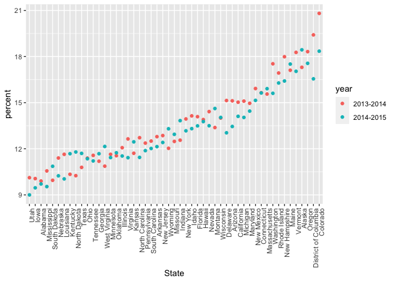
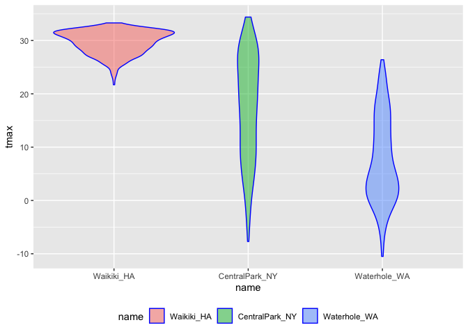
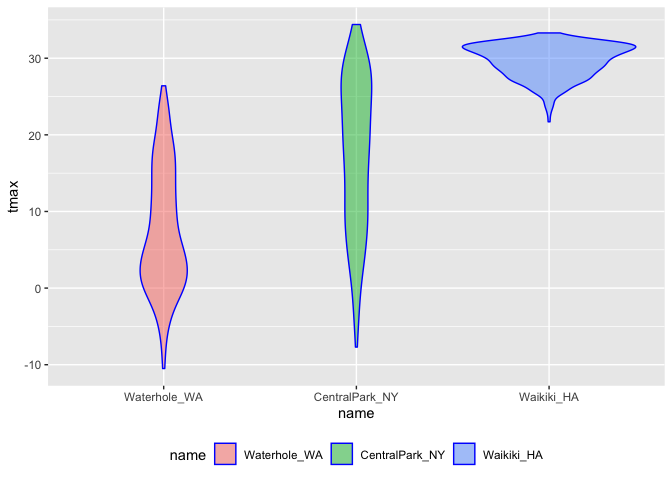

strings and factors
================

``` r
library(tidyverse)
```

    ## ── Attaching packages ──────────────────────────────────────────────────────────────────── tidyverse 1.3.0 ──

    ## ✓ ggplot2 3.3.2     ✓ purrr   0.3.4
    ## ✓ tibble  3.0.3     ✓ dplyr   1.0.2
    ## ✓ tidyr   1.1.2     ✓ stringr 1.4.0
    ## ✓ readr   1.3.1     ✓ forcats 0.5.0

    ## ── Conflicts ─────────────────────────────────────────────────────────────────────── tidyverse_conflicts() ──
    ## x dplyr::filter() masks stats::filter()
    ## x dplyr::lag()    masks stats::lag()

``` r
library(p8105.datasets)
library(rvest)
```

    ## Loading required package: xml2

    ## 
    ## Attaching package: 'rvest'

    ## The following object is masked from 'package:purrr':
    ## 
    ##     pluck

    ## The following object is masked from 'package:readr':
    ## 
    ##     guess_encoding

``` r
# add all the other plot options
```

## Strings and regular expression

``` r
string_vec = c("my", "name", "is", "jeff")

str_detect(string_vec, "jeff") # detect whether a string observation exists in a string
```

    ## [1] FALSE FALSE FALSE  TRUE

``` r
str_detect(string_vec, "e") # can detect single letter
```

    ## [1] FALSE  TRUE FALSE  TRUE

``` r
str_replace(string_vec, "jeff", "Jeff")
```

    ## [1] "my"   "name" "is"   "Jeff"

``` r
str_replace(string_vec, "j", "Jeff")
```

    ## [1] "my"      "name"    "is"      "Jeffeff"

``` r
string_vec = c(
  "i think we all rule for participating",
  "i think i have been caught",
  "i think this will be quite fun actually",
  "it will be fun, i think"
  )

str_detect(string_vec, "i think")
```

    ## [1] TRUE TRUE TRUE TRUE

``` r
str_detect(string_vec, "^i think") # test the string starting with I think
```

    ## [1]  TRUE  TRUE  TRUE FALSE

``` r
str_detect(string_vec, "i think$") # test the string ending with I think
```

    ## [1] FALSE FALSE FALSE  TRUE

``` r
string_vec = c(
  "Y'all remember Pres. HW Bush?",
  "I saw a green bush",
  "BBQ and Bushwalking at Molonglo Gorge",
  "BUSH -- LIVE IN CONCERT!!"
  )

str_detect(string_vec, "Bush")
```

    ## [1]  TRUE FALSE  TRUE FALSE

``` r
str_detect(string_vec,"[Bb]ush") # detect either B or b
```

    ## [1]  TRUE  TRUE  TRUE FALSE

``` r
string_vec = c(
  '7th inning stretch',
  '1st half soon to begin. Texas won the toss.',
  'she is 5 feet 4 inches tall',
  '3AM - cant sleep :('
  )

str_detect(string_vec, "^[0-9][a-zA-Z]")
```

    ## [1]  TRUE  TRUE FALSE  TRUE

``` r
string_vec = c(
  'Its 7:11 in the evening',
  'want to go to 7-11?',
  'my flight is AA711',
  'NetBios: scanning ip 203.167.114.66'
  )

str_detect(string_vec, "7.11") # dot . capture anything that between 7 and 11
```

    ## [1]  TRUE  TRUE FALSE  TRUE

``` r
str_detect(string_vec, "7\\.11") # to detect 7.11
```

    ## [1] FALSE FALSE FALSE  TRUE

``` r
string_vec = c(
  'The CI is [2, 5]',
  ':-]',
  ':-[',
  'I found the answer on pages [6-7]'
  )

str_detect(string_vec, "\\[") # to test [
```

    ## [1]  TRUE FALSE  TRUE  TRUE

# Factors

``` r
factor_vec = factor(c("male", "male", "female", "female"))

as.numeric(factor_vec)
```

    ## [1] 2 2 1 1

what happens if we relevel…

``` r
factor_vec = fct_relevel(factor_vec, "male") # change male as the first
```

## NSDUH

``` r
nsduh_url = "http://samhda.s3-us-gov-west-1.amazonaws.com/s3fs-public/field-uploads/2k15StateFiles/NSDUHsaeShortTermCHG2015.htm"

table_marj = 
  read_html(nsduh_url) %>% 
  html_nodes(css = "table") %>% 
  first() %>%
  html_table() %>%
  slice(-1) %>%
  as_tibble()

data_marj = 
  table_marj %>%
  select(-contains("P Value")) %>% # contains is similar to detect
  pivot_longer(
    -State, # we want everything except state
    names_to = "age_year", 
    values_to = "percent") %>%
  separate(age_year, into = c("age", "year"), sep = "\\(") %>% # ( is a special thing for regular expression
  mutate(
    year = str_replace(year, "\\)", ""), # string operation can be used in mutate()
    percent = str_replace(percent, "[a-c]$", ""), # add $ to see if all the letters in the data is added in the same way.
    percent = as.numeric(percent)) %>%
  filter(!(State %in% c("Total U.S.", "Northeast", "Midwest", "South", "West")))
```

## NSDUH - factors

``` r
data_marj %>%
  filter(age == "12-17") %>% 
  mutate(State = fct_reorder(State, percent)) %>% 
  ggplot(aes(x = State, y = percent, color = year)) + 
    geom_point() + 
    theme(axis.text.x = element_text(angle = 90, hjust = 1))
```

<!-- -->

## Restaurant data

``` r
data("rest_inspec")

rest_inspec %>% 
  group_by(boro, grade) %>% 
  summarize(n = n()) %>% 
  spread(key = grade, value = n)
```

    ## `summarise()` regrouping output by 'boro' (override with `.groups` argument)

    ## # A tibble: 6 x 8
    ## # Groups:   boro [6]
    ##   boro              A     B     C `Not Yet Graded`     P     Z `<NA>`
    ##   <chr>         <int> <int> <int>            <int> <int> <int>  <int>
    ## 1 BRONX         13688  2801   701              200   163   351  16833
    ## 2 BROOKLYN      37449  6651  1684              702   416   977  51930
    ## 3 MANHATTAN     61608 10532  2689              765   508  1237  80615
    ## 4 Missing           4    NA    NA               NA    NA    NA     13
    ## 5 QUEENS        35952  6492  1593              604   331   913  45816
    ## 6 STATEN ISLAND  5215   933   207               85    47   149   6730

## weather data

``` r
weather_df = 
  rnoaa::meteo_pull_monitors(
    c("USW00094728", "USC00519397", "USS0023B17S"),
    var = c("PRCP", "TMIN", "TMAX"), 
    date_min = "2017-01-01",
    date_max = "2017-12-31") %>%
  mutate(
    name = recode(
      id, 
      USW00094728 = "CentralPark_NY", 
      USC00519397 = "Waikiki_HA",
      USS0023B17S = "Waterhole_WA"),
    tmin = tmin / 10,
    tmax = tmax / 10) %>%
  select(name, id, everything())
```

    ## Registered S3 method overwritten by 'hoardr':
    ##   method           from
    ##   print.cache_info httr

    ## using cached file: /Users/wangyuqi/Library/Caches/R/noaa_ghcnd/USW00094728.dly

    ## date created (size, mb): 2020-10-05 10:31:49 (7.522)

    ## file min/max dates: 1869-01-01 / 2020-10-31

    ## using cached file: /Users/wangyuqi/Library/Caches/R/noaa_ghcnd/USC00519397.dly

    ## date created (size, mb): 2020-10-05 10:31:54 (1.699)

    ## file min/max dates: 1965-01-01 / 2020-03-31

    ## using cached file: /Users/wangyuqi/Library/Caches/R/noaa_ghcnd/USS0023B17S.dly

    ## date created (size, mb): 2020-10-05 10:31:56 (0.88)

    ## file min/max dates: 1999-09-01 / 2020-10-31

``` r
weather_df %>%
  mutate(name = forcats::fct_relevel(name, c("Waikiki_HA", "CentralPark_NY", "Waterhole_WA"))) %>% 
  ggplot(aes(x = name, y = tmax)) + 
  geom_violin(aes(fill = name), color = "blue", alpha = .5) + 
  theme(legend.position = "bottom")
```

    ## Warning: Removed 3 rows containing non-finite values (stat_ydensity).

<!-- -->

``` r
weather_df %>%
  mutate(name = forcats::fct_reorder(name, tmax)) %>% 
  ggplot(aes(x = name, y = tmax)) + 
  geom_violin(aes(fill = name), color = "blue", alpha = .5) + 
  theme(legend.position = "bottom")
```

    ## Warning: Removed 3 rows containing non-finite values (stat_ydensity).

<!-- -->

``` r
weather_df %>% 
  mutate(name = fct_reorder(name, tmax)) %>% 
  lm(tmax ~ name, data = .) # the name should be factor
```

    ## 
    ## Call:
    ## lm(formula = tmax ~ name, data = .)
    ## 
    ## Coefficients:
    ##        (Intercept)  nameCentralPark_NY      nameWaikiki_HA  
    ##              7.482               9.884              22.176
